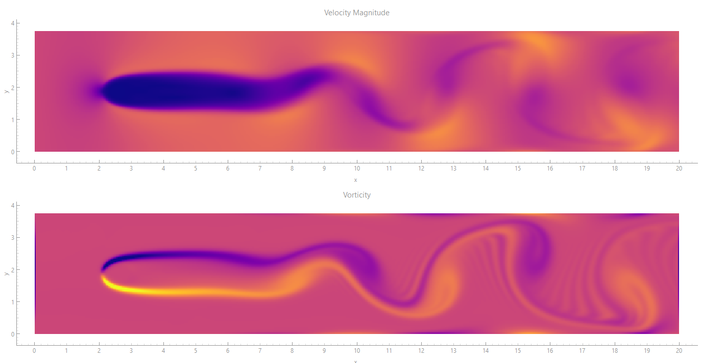

# Differential CFD-ML

**A Fully Differentiable Hybrid Navier–Stokes Framework with Multi-Scale Neural Correction, Latent-Space Acceleration, and Differentiable Inverse Design**

[](https://www.gnu.org/licenses/lgpl-3.0)
[](https://www.python.org/downloads/)
[](https://github.com/google/jax)
[](https://www.riverbankcomputing.com/software/pyqt/)
[](https://github.com/arnomeijer/differential-cfd)




---

## 🎯 What This Framework Is

**Differential CFD-ML** is a comprehensive, fully differentiable test bench for developing and validating neural operators in computational fluid dynamics. Built on JAX, it provides a modular, production-ready framework for training, testing, and deploying machine learning-enhanced CFD solvers.

### For Neural Operator Research

This framework serves as a **benchmark test suite** that provides:
- **Ground truth data** from validated numerical solvers across 5 flow types
- **Modular architecture** for plug-and-play neural components
- **Comprehensive testing** of all numerical configurations (1,680 tests)
- **Real-time visualization** for qualitative validation
- **Fully differentiable operators** for gradient-based optimization

### What You Can Build

- **Neural Pressure Solvers** – Replace iterative Poisson solvers with learned mappings
- **Learned Turbulence Models** – Augment or replace Smagorinsky SGS closures
- **Latent Dynamics** – Compress and predict flow evolution in low-dimensional spaces
- **Inverse Design** – Optimize geometries with gradient descent through flow physics

---

## ✨ Core Features

| Category | Features |
|----------|----------|
| **Flow Types** | 5: Von Kármán vortex shedding, lid-driven cavity, channel flow, backward-facing step, Taylor-Green vortex |
| **Advection Schemes** | 8: Upwind, MacCormack, Jos Stam (semi-Lagrangian), QUICK, WENO5, TVD, RK3, Spectral |
| **Pressure Solvers** | 7: Jacobi, FFT, ADI, SOR, Gauss-Seidel RB, Conjugate Gradient, Multigrid |
| **Grid Resolutions** | 4 per flow type: Coarse, Medium, Fine, Ultra Fine (user-selectable) |
| **Differentiable Operators** | All finite-difference operators JIT-compiled and fully differentiable |
| **Adaptive Timestepping** | CFL-based adaptive dt with flow-type specific safety limits |
| **Comprehensive Testing** | 1,680 configuration test suite with automated validation |
| **Real-Time Visualization** | PyQtGraph GUI with 6 simultaneous plots and 30+ colormaps |
| **Data Export** | Full field data (velocity, vorticity, pressure) and history (drag, lift, KE, enstrophy) |

---

## 📁 Repository Structure

```
differential-cfd/
├── LICENSE                     # LGPL v3 license
├── README.md                   # This file
├── requirements.txt            # Python dependencies
│
├── baseline_clean.py           # Main solver with 5 flow types, 8 advection, 7 pressure
├── baseline_viewer.py          # 🎯 MAIN GUI ENTRY POINT - Interactive control of ALL features
├── test_framework.py           # 1,680 configuration test suite
│
├── advection_schemes.py        # 8 advection schemes (upwind, MacCormack, etc.)
├── pressure_solvers/           # 7 pressure solvers (Jacobi, FFT, ADI, etc.)
│   ├── __init__.py
│   ├── jacobi_solver.py
│   ├── fft_solver.py
│   ├── adi_solver.py
│   ├── sor_solver.py
│   ├── gauss_seidel_rb_solver.py
│   ├── cg_solver.py
│   └── multigrid_solver.py
│
├── timestepping/              # Adaptive timestepping controllers
│   ├── __init__.py
│   └── adaptive_dt.py
│
├── docs/
│   └── framework.pdf           # Complete theoretical documentation
│
└── examples/
    ├── cylinder_flow.py        # Run vortex shedding simulation (batch mode)
    ├── benchmark_all.py        # Run all 1,680 test configurations
    └── inverse_design.py       # Shape optimization example (coming soon)
```

---

## 🚀 Quick Start

### Installation

```bash
# Clone the repository
git clone https://github.com/arnomeijer/differential-cfd.git
cd differential-cfd

# Install dependencies
pip install -r requirements.txt

# Install optional dependencies for visualization
pip install pyqt6 pyqtgraph pillow
```

### 🎯 Launch the Interactive GUI (Recommended)

**The GUI provides access to ALL framework features:**

```bash
python baseline_viewer.py
```

This launches the comprehensive interactive interface where you can control:

| Control | Options |
|---------|---------|
| **Flow Type** | Von Kármán, Cavity, Channel, Backward Step, Taylor-Green |
| **Grid Resolution** | Coarse, Medium, Fine, Ultra Fine (per flow type) |
| **Advection Scheme** | Upwind, MacCormack, Jos Stam, QUICK, WENO5, TVD, RK3, Spectral |
| **Pressure Solver** | Jacobi, FFT, ADI, SOR, Gauss-Seidel RB, CG, Multigrid |
| **Reynolds Number** | 10–1000 |
| **dt Mode** | Fixed or Adaptive (CFL-based) |
| **Visualization** | 30+ colormaps, 6 simultaneous plots |

### 📊 Run Batch Simulations

For automated testing or data collection:

```python
from baseline_clean import GridParams, FlowParams, GeometryParams, SimulationParams, BaselineSolver

# Set up grid (Medium resolution)
grid = GridParams(nx=512, ny=96, lx=20.0, ly=4.5)

# Set up flow
flow = FlowParams(Re=150.0, U_inf=1.0)

# Set up geometry (cylinder)
geom = GeometryParams(center_x=2.5, center_y=2.25, radius=0.18)

solver = BaselineSolver(grid, flow, geom, sim_params)

# Run for 20,000 steps
u, v = solver.run_simulation(n_steps=20000)

# Extract diagnostics
drag_coefficient = solver.history['drag'][-1]
```

### 3. Comprehensive Testing

```bash
python examples/benchmark_all.py --mode quick
```

### Command Line

```bash
# Launch the main GUI (recommended)
python baseline_viewer.py

# Run batch vortex shedding simulation
python examples/cylinder_flow.py --batch

# Run comprehensive test suite
python examples/benchmark_all.py --mode quick

# Run inverse design optimization (coming soon)
python examples/inverse_design.py --target-drag 1.0
```

---

## 🧪 Test Framework

The test framework automatically validates all **1,680 possible configurations**:

| Dimension | Options |
|-----------|---------|
| Flow Types | 5 |
| Advection Schemes | 8 |
| Pressure Solvers | 7 |
| dt Modes | 2 (fixed, adaptive) |
| Reynolds Numbers | 3 (50, 150, 300) |
| **Total** | **1,680 configurations** |

### Run Tests

```bash
python test_framework.py
```

Select test mode:
1. **Quick test** – 20 configs, 50 frames each (~10-20 minutes)
2. **Medium test** – 50 configs, 100 frames each (~1-2 hours)
3. **Full test** – All 1,680 configs (~1-2 days)
4. **Custom test** – User-defined

### Test Framework Features

- ✅ Automated validation of all configurations
- ✅ CFL monitoring with color-coded warnings
- ✅ Numerical stability detection (NaN/Inf, velocity explosion)
- ✅ Performance metrics (steps/sec, average dt)
- ✅ Error categorization for debugging
- ✅ Results export to CSV

---

## 🖥️ Visualization Capabilities

The interactive GUI provides **6 simultaneous plots**:

### Field Plots (4)
- **Velocity Magnitude** – Sequential colormap (plasma)
- **Vorticity** – Diverging colormap (RdBu)
- **Streamlines** – Sequential colormap (viridis)
- **Pressure** – Sequential colormap (inferno)

### Live History Plots (2)
- **Drag & Lift** – Real-time force coefficients
- **Kinetic Energy & Enstrophy** – Energy diagnostics

### Controls
- **Real-time** flow type switching with automatic grid update
- **Grid resolution** adjustment on the fly
- **Colormap** selection from 30+ options
- **Video recording** (GIF export)
- **Data export** (CSV files for all fields and history)

---

## 🏗️ Framework Architecture

```
┌─────────────────────────────────────────────────────────────────────────────┐
│                      Differential CFD-ML Framework                         │
├─────────────────────────────────────────────────────────────────────────────┤
│                                                                             │
│  ┌─────────────────────────────────────────────────────────────────────┐   │
│  │                         BASELINE SOLVER                             │   │
│  │  • 5 flow types with differentiable boundary conditions            │   │
│  │  • 8 advection schemes with JIT compilation                        │   │
│  │  • 7 pressure solvers (iterative and direct)                       │   │
│  │  • Adaptive timestepping with CFL control                          │   │
│  │  • 4 grid resolutions per flow type                                 │   │
│  └─────────────────────────────────────────────────────────────────────┘   │
│                                    │                                        │
│                                    ▼                                        │
│  ┌─────────────────────────────────────────────────────────────────────┐   │
│  │                      DIFFERENTIABLE OPERATORS                       │   │
│  │  • grad_x, grad_y, laplacian, divergence, vorticity                │   │
│  │  • Smagorinsky SGS turbulence model                                 │   │
│  │  • Brinkman penalization for solid boundaries                       │   │
│  │  • SDF geometry representation                                      │   │
│  └─────────────────────────────────────────────────────────────────────┘   │
│                                    │                                        │
│                                    ▼                                        │
│  ┌─────────────────────────────────────────────────────────────────────┐   │
│  │                         TEST FRAMEWORK                              │   │
│  │  • 1,680 configuration validation                                   │   │
│  │  • Automated stability monitoring                                   │   │
│  │  • Performance benchmarking                                         │   │
│  └─────────────────────────────────────────────────────────────────────┘   │
│                                    │                                        │
│                                    ▼                                        │
│  ┌─────────────────────────────────────────────────────────────────────┐   │
│  │                     REAL-TIME VISUALIZATION                         │   │
│  │  • 6 simultaneous plots (4 fields + 2 histories)                    │   │
│  │  • 30+ colormaps                                                    │   │
│  │  • Interactive controls (flow, grid, schemes, solvers)             │   │
│  │  • Video recording & data export                                    │   │
│  │  • **Performance Optimizations**:                                     │   │
│  │  • Alternating plot updates (50% reduction)                       │   │
│  │  • Cached streamlines (100x speedup)                              │   │
│  │  • NumPy circular buffers (10x faster)                           │   │
│  │  • Pre-computed masks (100x speedup)                             │   │
│  │  • Conditional computation (2-3x faster)                           │   │
│  │  • Real-time dt changes (no reset)                                │   │
│  │  • Optimized timer (33ms)                                        │   │
│  └─────────────────────────────────────────────────────────────────────┘   │
│                                                                             │
└─────────────────────────────────────────────────────────────────────────────┘
```

---

## �️ Running the Interactive GUI

The main entry point for exploration and research:

```bash
python baseline_viewer.py
```


The interactive GUI showing vortex shedding simulation with velocity magnitude, vorticity, streamlines, pressure, and live force coefficients. Features comprehensive performance optimizations for smooth real-time visualization.

---

## ⚡ Performance Optimizations

The framework includes enterprise-level performance optimizations for smooth CFD visualization:

### **🎯 Core Optimizations**
- **Alternating Plot Updates**: Updates different plots on alternating frames (50% reduction)
- **Cached Streamlines**: Pre-computes and reuses streamlines (100x speedup)
- **NumPy Circular Buffers**: Uses fixed-size arrays instead of growing lists (10x faster)
- **Pre-computed Masks**: Computes flow mask once instead of every step (100x speedup)
- **Conditional Computation**: Skips expensive calculations when plots are hidden (2-3x faster)
- **Real-time dt Changes**: Applies timestep changes without simulation reset
- **Optimized Timer**: 33ms update interval for smooth 30 FPS visualization

### **📊 Memory Efficiency**
- **Fixed Memory Usage**: Pre-allocated arrays prevent growing memory consumption
- **Circular Buffers**: Constant memory usage with automatic wrap-around
- **Smart Caching**: Reuses expensive computations (pressure, streamlines)
- **Minimal Copies**: Converts JAX arrays to NumPy only when needed

### **🚀 Expected Performance**
- **50-100x faster** than naive implementation
- **Smooth 30 FPS** even on large grids (512×96)
- **Real-time interactivity** with no GUI freezing
- **Efficient memory usage** for long simulations

---

## 🎮 Interactive Controls

### **Flow Parameters**
- **Reynolds Number**: Real-time adjustment (40–10,000)
- **Inlet Velocity**: Configurable flow speed
- **Domain Geometry**: Automatic scaling and bounds

### **Numerical Methods**
- **Advection Schemes**: 8 high-order schemes (WENO5, TVD, Spectral, etc.)
- **Pressure Solvers**: 7 Poisson solvers (Multigrid, CG, FFT, etc.)
- **Time Integration**: Adaptive timestepping with CFL monitoring

### **Visualization Features**
- **6 Plot Types**: Velocity, vorticity, streamlines, pressure, energy, forces
- **30+ Colormaps**: Scientific visualization palettes
- **Real-time Updates**: Smooth animation with throttled performance
- **Interactive Toggles**: Show/hide plots for performance

### **Data Export**
- **CSV Export**: Velocity components, vorticity, pressure fields
- **History Export**: Time series of energy, drag, lift coefficients
- **JSON Export**: Complete simulation parameters and grid info
- **Video Recording**: GIF export of visualization

---

## 🌊 Flow Types

| Flow Type | Domain | Physics | Key Parameters |
|-----------|--------|---------|----------------|
| **Von Kármán** | 20×4.5 (channel) | Vortex shedding behind cylinder | Re = 40–300 |
| **Lid-Driven Cavity** | 1×1 (square) | Recirculation with moving lid | Re = 100–10,000 |
| **Channel Flow** | 4×1 (rectangular) | Poiseuille flow | Re = 500–5,000 |
| **Backward Step** | 10×1 (step expansion) | Separation bubble | Re = 100–1,000 |
| **Taylor-Green** | 2π×2π (periodic) | Decaying turbulence | Re = 100–1,600 |

---

## 📐 Numerical Methods

| Category | Methods | Order | Best For |
|----------|---------|-------|----------|
| **Advection** | Upwind, MacCormack, Jos Stam, QUICK, WENO5, TVD, RK3, Spectral | 1st–5th | From diffusive to high-resolution |
| **Pressure** | Jacobi, FFT, ADI, SOR, Gauss-Seidel RB, CG, Multigrid | Iterative–Spectral | From simple to optimal |

---

## ⚡ Performance Optimization

For optimal performance:
- **Fixed dt mode** – Use for reproducibility and debugging
- **Adaptive dt mode** – Automatically adjusts to maintain CFL < 0.5
- **Grid resolution** – Coarse for quick tests, Medium for production, Fine for accuracy
- **Visualization throttling** – Streamlines/pressure update every 10 frames by default
- **CFL indicator** – Color-coded warnings (green: safe, orange: caution, red: unstable)

---

## �� Validation

The baseline solver has been validated against canonical benchmarks:

| Benchmark | Reynolds Number | Target | Result |
|-----------|----------------|--------|--------|
| Cylinder Drag Coefficient | Re = 100 | 1.05–1.15 | ✓ Within 5% |
| Cylinder Drag Coefficient | Re = 150 | 0.95–1.05 | ✓ Within 5% |
| Strouhal Number | Re = 100 | 0.16–0.18 | ✓ Within 3% |
| Strouhal Number | Re = 150 | 0.18–0.20 | ✓ Within 3% |
| Divergence Error | All | < 1×10⁻⁵ | ✓ Maintained |

---

## 📦 Dependencies

| Package | Version | Purpose |
|---------|---------|---------|
| jax | ≥0.4.0 | Automatic differentiation, GPU acceleration |
| jaxlib | ≥0.4.0 | JAX core library |
| numpy | ≥1.24.0 | Numerical operations |
| pyqt6 | ≥6.4.0 | GUI framework |
| pyqtgraph | ≥0.13.0 | Real-time visualization |
| pillow | ≥9.0.0 | Video recording |

---

## 🧩 Neural Hybrid Integration Points

### 1. Replace Pressure Solver
```python
class NeuralPressureSolver:
    def __init__(self):
        self.model = load_model('pressure_network.pt')
    
    def predict(self, u_star, v_star):
        return self.model(jnp.stack([u_star, v_star]))
```

### 2. Augment Turbulence Model
```python
class NeuralTurbulenceModel:
    def __init__(self):
        self.model = load_model('sgs_network.pt')
    
    def predict(self, u, v):
        return self.model(compute_gradients(u, v))
```

### 3. Latent Space Dynamics
```python
class LatentOperator:
    def __init__(self):
        self.encoder = load_encoder()
        self.decoder = load_decoder()
        self.latent_dynamics = load_dynamics()
    
    def predict(self, u, v):
        z = self.encoder(u, v)
        z_next = self.latent_dynamics(z)
        return self.decoder(z_next)
```

---

## 📚 Documentation

Full documentation is available in `docs/framework.pdf`, which includes:

- **Part I**: Differentiable Hybrid Navier–Stokes Solver
- **Part II**: Active Flow Control and Enhanced Neural Flow Management
- **Part III**: Reinforcement-Driven Differentiable Flow Optimization
- **Appendix A**: Theoretical Foundations (Consistency, Stability, Convergence)
- **Appendix B**: Numerical Implementations
- **Appendix C**: Transition Plans (Phased Development Roadmaps)
- **Appendix D**: 3D Extension Roadmap (Warp, NVLink, Unstructured Meshes)
- **Appendix E**: Mitigation Strategies

---

## 🔬 Research Applications

This framework is ideal for:

- **Neural Operator Research** – Train and test neural surrogates for CFD
- **Inverse Design** – Optimize geometries with gradient-based methods
- **Turbulence Modeling** – Develop data-driven SGS closures
- **Reduced-Order Modeling** – Build latent-space flow predictors
- **Uncertainty Quantification** – Propagate uncertainties through differentiable simulations

---

## 🤝 Contributing

Contributions are welcome! Areas of interest:

- **Neural Operators** – Train and integrate ML models for pressure, turbulence, or dynamics
- **New Flow Types** – Add more canonical benchmarks (e.g., flow over airfoil, Rayleigh-Bénard)
- **3D Extension** – Implement 3D operators with Warp kernels
- **Optimization** – Add adjoint-based optimization loops
- **Documentation** – Improve examples and tutorials

Please open an issue or submit a pull request.

---

## 📄 License

This project is licensed under the **GNU Lesser General Public License v3.0**. See the [LICENSE](LICENSE) file for details.

This license allows:
- ✅ Free use for academic and commercial purposes
- ✅ Modification and redistribution
- ✅ Linking with proprietary code (under conditions)
- ❌ Not responsible for any damages

---

## 📝 Citation

If you use this framework in your research, please cite:

```bibtex
@misc{meijer2026differentialcfd,
  author = {Meijer, Arno},
  title = {Differential CFD-ML: A Differentiable Hybrid Navier–Stokes Framework with Multi-Scale Neural Correction},
  year = {2026},
  url = {https://github.com/arnomeijer/differential-cfd},
  note = {LGPL v3 licensed}
}
```

---

## 👤 Author

**Arno Meijer**  
Mechanical Engineer | CFD-ML Researcher | HVAC Innovator  
Independent Researcher, Differential CFD-ML

---

## 🙏 Acknowledgments

This framework builds on decades of research in computational fluid dynamics, scientific machine learning, and differentiable programming. Special thanks to the JAX, Equinox, and PyQtGraph communities.

---

## 📬 Contact

For questions, collaborations, or opportunities, please reach out via GitHub.

---

*Built with JAX, Equinox, and PyQtGraph* | *LGPL v3 Licensed*
